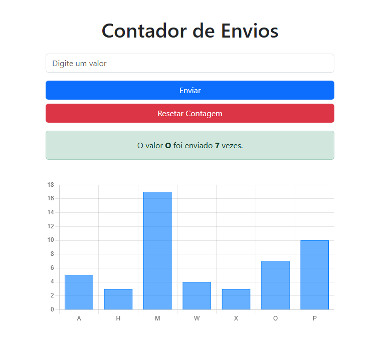

# 📊 Contador de Valores com Gráfico (Node.js + Express + Chart.js)

Este é um sistema web desenvolvido para a disciplina de **Linguagem de Programação Script**, com o objetivo de praticar o uso de linguagens de script na criação de aplicações web interativas. A aplicação permite enviar valores ao servidor, contabilizar a quantidade de envios e visualizar os dados por meio de um gráfico dinâmico.

## 🚀 Funcionalidades

- ✅ Interface intuitiva com Bootstrap 5
- ✅ Envio de valores via formulário
- ✅ Contabilização e persistência dos dados em arquivo JSON (`contador.json`)
- ✅ Gráfico de barras em tempo real com Chart.js
- ✅ Botão para resetar contagem
- ✅ Comunicação entre frontend e backend via requisições HTTP

---

## 📷 Demonstração



---

## 🛠 Tecnologias Utilizadas

- [Node.js](https://nodejs.org/)
- [Express.js](https://expressjs.com/)
- [Chart.js](https://www.chartjs.org/)
- [Bootstrap 5](https://getbootstrap.com/)
- HTML5, CSS3, JavaScript

---

## 📁 Estrutura do Projeto

```
├── contador-valores
│   ├── assets/
│   │   └── screenshot.png
│   ├── public/
│   │   └── index.html
│   ├── .gitignore
│   ├── contador.json
│   ├── package-lock.json
│   ├── package.json
│   ├── server.js

```

---

## ⚙️ Como Executar

### 1. Clone o repositório

```bash
git clone https://github.com/seu-usuario/contador-valores.git
cd contador-valores
```

### 2. Instale as dependências

```bash
npm install
```

### 3. Crie o arquivo de dados

```bash
echo "{}" > contador.json
```

### 4. Inicie o servidor

```bash
node server.js
```

### 5. Acesse no navegador

```bash
http://localhost:3000
```

## 🔄 Rotas da API

- `POST` `/contar` – Recebe um valor e retorna a quantidade atual de envios desse valor.
- `POST` `/resetar` – Reseta toda a contagem.
- `GET` `/dados` – Retorna todos os dados salvos no contador.

## 🧾 Requisitos Atendidos (Atividade)

- ☑️ Receber valores do usuário via frontend.
- ☑️ Enviar e processar dados no backend com contagem por valor.
- ☑️ Persistência simples usando JSON.
- ☑️ Atualização e exibição visual com gráfico.
- ☑️ Interface web clara e interativa.

## 👨‍💻 Desenvolvedor

- **Nome:** William  
- **Curso:** Sistemas e Mídias Digitais – Universidade Federal do Ceará (UFC)  
- **Disciplina:** Linguagem de Programação Script
